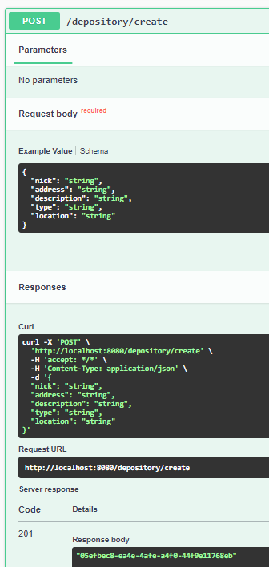
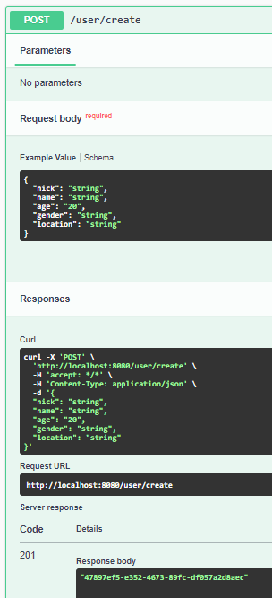
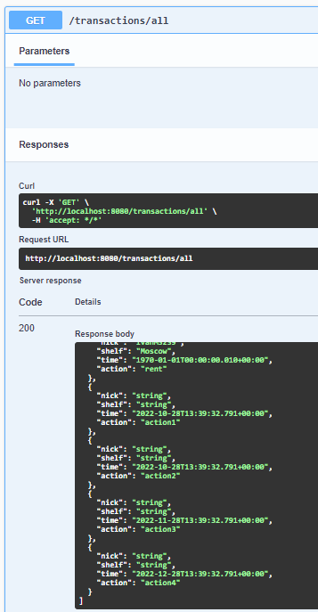
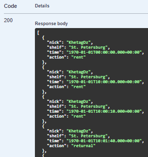
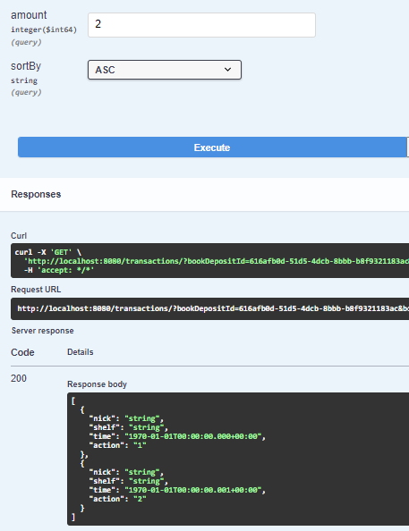
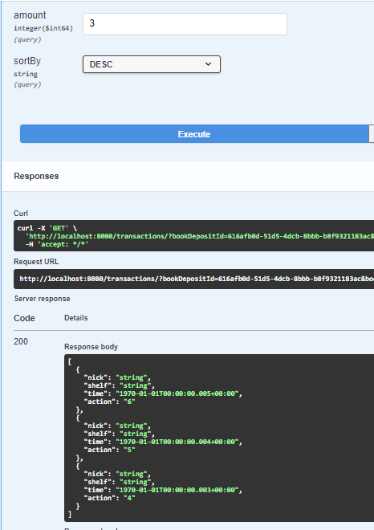

# Task

Работа со Spring Boot приложением.

### Common

- Используя IntelliJ Idea 2022.1 импортировать Maven проект [pom.xml](pom.xml).
- Убедиться, что все зависимости были установлены.

### Project building:

- Убедиться, что установлена системная переменная ```JAVA_HOME``` к OpenJDK 17+.
- Запустить ```.\mvnw clean install``` из корневой папки [Maven проекта](pom.xml).
- Готовый к запуску **jar** файл будет находиться в ```.\target\<version>.jar```.

### Application Run:

- Убедиться, что в переменных среды окружения корректно установлен ```PATH``` до OpenJDK 17+
- Запустить из командной строки из корневой папки [Maven проекта](pom.xml):

```bash 
java -jar demo-0.0.1-SNAPSHOT.jar
```

- Перейти на страничку [OpenAPI](http://localhost:8080/swagger-ui/index.html)

### Результат

- На примере ниже мы создаем несодержательный Depository и UserProfile и помещаем несколько транзакций на их связку.

  
  
- Выводим список всех транзакций (их будет на несколько больше)

  
  
- И наконец используем нашу функцию с разными параметрами

  
  
- Пока что (в задании не требовалось) реализовать валидацию данных, так что в случае некорректных значений словим 500