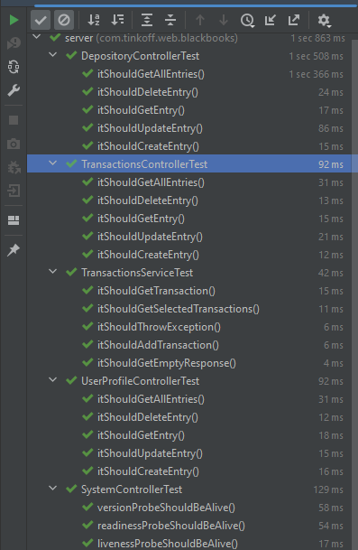

# Task

Тестирование Spring Boot Application.

### Common

- Используя IntelliJ Idea 2022.1 импортировать Maven проект [pom.xml](pom.xml).
- Убедиться, что все зависимости были установлены.

### Project building:

- Убедиться, что установлена системная переменная ```JAVA_HOME``` к OpenJDK 17+.
- Запустить ```.\mvnw clean install test``` из корневой папки [Maven проекта](pom.xml).

### Результат

- Интеграционное тестирование + юнит тестирование на мой сервис.
  
- Замоканные репозитории зарефакторю