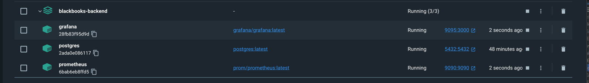
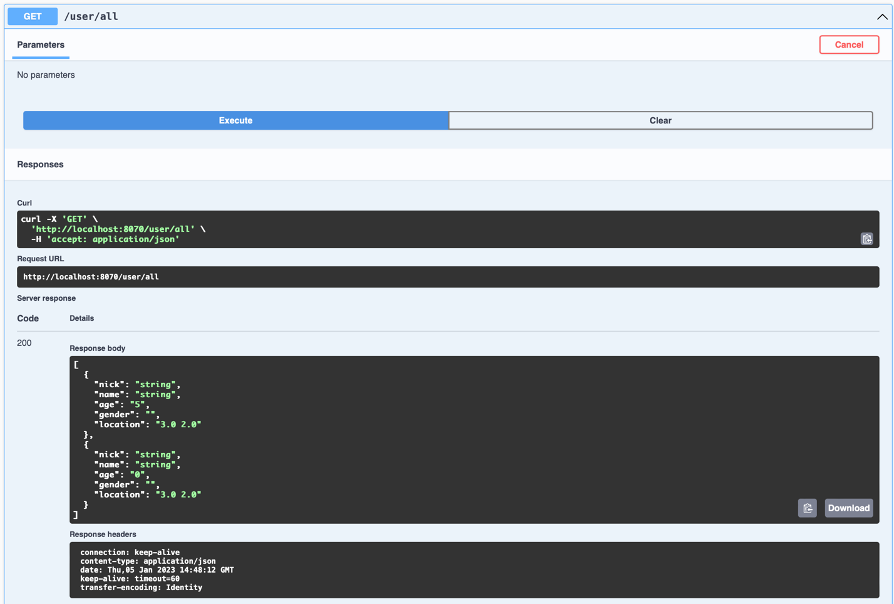
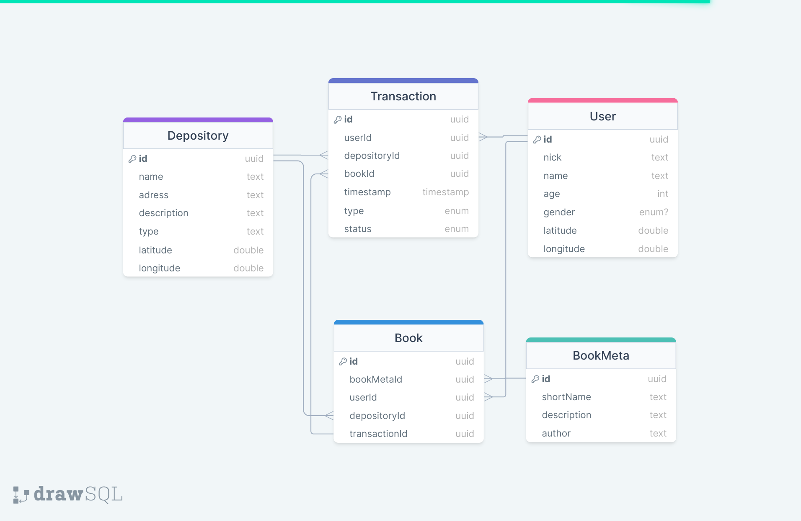

# Task

Внедрение полноценной базы данных.

### Common

- Используя IntelliJ Idea 2022.1 импортировать Maven проект [pom.xml](pom.xml).
- Поднять Docker контейнер с помощью compose файла.
- Убедиться в работоспособности БД.
- Убедиться, что все зависимости были установлены.

### Project building:

- Убедиться, что установлена системная переменная ```JAVA_HOME``` к OpenJDK 17+.
- Запустить ```.\mvnw clean install test``` из корневой папки [Maven проекта](pom.xml).

### Результат

- Для простоты при тестировании используется dev-профиль базы данных, поскольку сохранность данных нам пока не важна.
- Позже будет проведен рефакторинг под Spring Test Containers (или конфигурацию временных таблиц)





